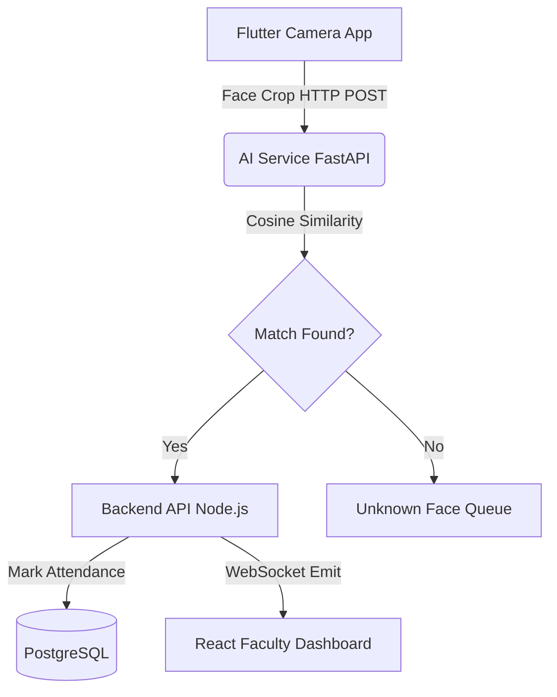

# System Architecture

## Component Interaction

## AI Pipeline Decision Engine

1. **Detection**: MediaPipe (Local Flutter App)
2. **Alignment & Embedding**: InsightFace ONNX (AI Service)
3. **Thresholding**: 0.5 Cosine Similarity
4. **Observation Count**: Must see face 3 times confidently before marking present.
